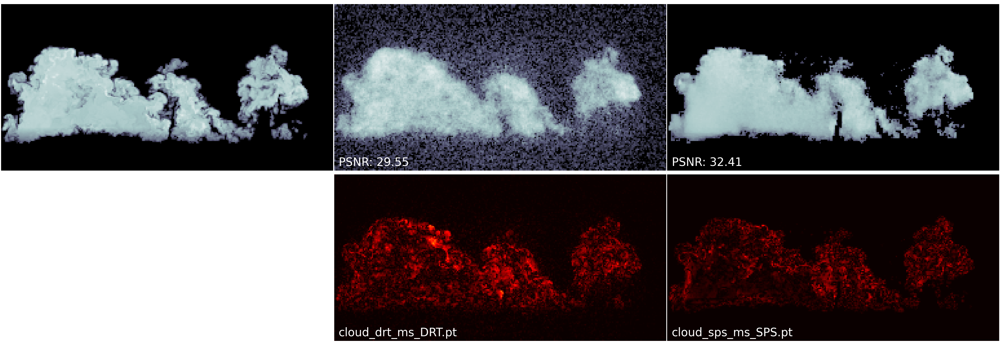
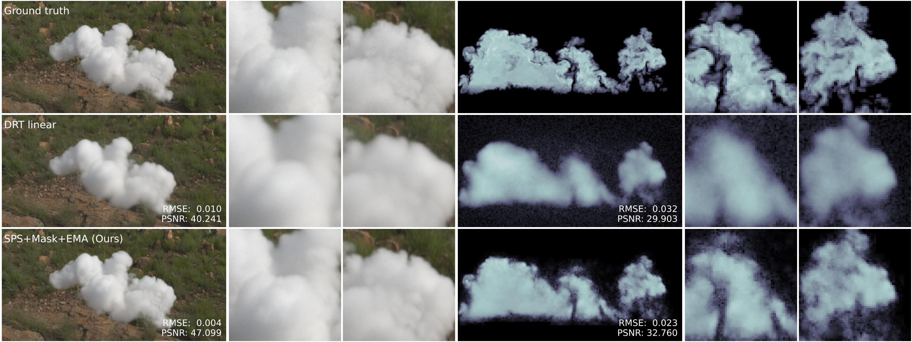

<!DOCTYPE html>
<html lang="en">
<head>
    <meta charset="UTF-8">
    <meta name="viewport" content="width=device-width, initial-scale=1.0">
    <title>Image Comparision Slider</title>
    <link rel="icon" href="./docs/favicon.png" type="image/png">
    <link rel="stylesheet" href="./docs/style.scss">
    <style>
    </style>
</head>
<body>
    <main>
        <header>
            <h1>Image Comparision Slider</h1>
        </header>
        <div class="container">
            <div class="image-container">
                
                
            </div>
            <input type="range" min="0" max="100" value="50" aria-label="Percentage of before photo shown"
                class="slider">
            <div class="slider-line" aria-hidden="true"></div>
            <div class="slider-button" aria-hidden="true">
                <svg xmlns="http://www.w3.org/2000/svg" width="30" height="30" fill="currentColor"
                    viewBox="0 0 256 256">
                    <rect width="256" height="256" fill="none"></rect>
                    <line x1="128" y1="40" x2="128" y2="216" fill="none" stroke="currentColor" stroke-linecap="round"
                        stroke-linejoin="round" stroke-width="16"></line>
                    <line x1="96" y1="128" x2="16" y2="128" fill="none" stroke="currentColor" stroke-linecap="round"
                        stroke-linejoin="round" stroke-width="16"></line>
                    <polyline points="48 160 16 128 48 96" fill="none" stroke="currentColor" stroke-linecap="round"
                        stroke-linejoin="round" stroke-width="16"></polyline>
                    <line x1="160" y1="128" x2="240" y2="128" fill="none" stroke="currentColor" stroke-linecap="round"
                        stroke-linejoin="round" stroke-width="16"></line>
                    <polyline points="208 96 240 128 208 160" fill="none" stroke="currentColor" stroke-linecap="round"
                        stroke-linejoin="round" stroke-width="16"></polyline>
                </svg>
            </div>
        </div>
    </main>
    <script>

        var file1 = {}
        var file1Selected = false;
        var file2 = {}
        var file2Selected = false;

        function selectImage(imageNumber) {
            const inputElement = document.getElementById(`imageUpload${imageNumber}`);
            const file = inputElement.files[0];

            if (file && file.type.startsWith('image/')) {
                if (imageNumber === 1) {
                    file1 = file;
                    file1Selected = true;
                    document.querySelector(`label[for="imageUpload${imageNumber}"]`).innerText = 'Change After Image';
                    document.querySelector(`label[for="imageUpload${imageNumber}"]`).style.backgroundColor = 'green';
                } else {
                    file2 = file;
                    file2Selected = true;
                    document.querySelector(`label[for="imageUpload${imageNumber}"]`).innerText = 'Change Before Image';
                    document.querySelector(`label[for="imageUpload${imageNumber}"]`).style.backgroundColor = 'green';
                }

                if (file1Selected && file2Selected) {
                    document.querySelector('.showDiff').style.setProperty('visibility', 'visible');
                }
            } else {
                alert('Please select a valid image file.');
                inputElement.value = '';
            }
        }

        function setAspectRatio(imageNumber) {
            const imageElement = document.querySelector(`.image-${imageNumber}`);
            const aspectRatio = imageElement.naturalWidth / imageElement.naturalHeight;
            const aspectRatioString = aspectRatio.toString();
            document.querySelector('.image-container').style.setProperty('--aspect-ratio', aspectRatioString);
        }

        const container = document.querySelector('.container');
        const slider = document.querySelector('.slider');

        slider.addEventListener('input', function (e) {
            container.style.setProperty('--position', e.target.value + '%');
        });
        function loadImages() {
            if (file1 && file2) {
                const image1 = document.querySelector('.image-1');
                const image2 = document.querySelector('.image-2');

                image1.src = URL.createObjectURL(file1);
                image2.src = URL.createObjectURL(file2);

                const checkAspectRatio = () => {
                    const aspectRatio1 = image1.naturalWidth / image1.naturalHeight;
                    const aspectRatio2 = image2.naturalWidth / image2.naturalHeight;

                    if (aspectRatio1 === aspectRatio2) {
                        setAspectRatio(1);
                        setAspectRatio(2);
                        document.querySelector(`label[for="imageUpload1"]`).style.backgroundColor = '#0a192f';
                        document.querySelector(`label[for="imageUpload2"]`).style.backgroundColor = '#0a192f';

                    } else {
                        alert('Aspect ratios of the images must be the same. Please select images with the same aspect ratio.');
                        image1.src = './images/img1.png';
                        image2.src = './images/img2.png';
                        document.querySelector(`label[for="imageUpload1"]`).innerText = 'Select After Image';
                        document.querySelector(`label[for="imageUpload2"]`).innerText = 'Select Before Image';
                        document.querySelector(`label[for="imageUpload1"]`).style.backgroundColor = '#0a192f';
                        document.querySelector(`label[for="imageUpload2"]`).style.backgroundColor = '#0a192f';
                        document.querySelector('.showDiff').style.setProperty('visibility', 'hidden');

                    }
                };

                image1.onload = checkAspectRatio;
                image2.onload = checkAspectRatio;
            }
        }

    </script>
</body>

</html>

# Image-based Reconstruction of Heterogeneous Media in the Presence of Multiple Light-Scattering
Ludwig Leonard and Rüdiger Westermann<br>Technical University of Munich<br>
| [Full paper] (https://) | 


<!--
## Abstract

Image-based reconstruction of a three-dimensional heterogeneous density field in the
presence of multiple scattering of light is intrinsically under-constrained. This leads to
reconstructions that look similar to the ground truth when rendered, but the recovered
field is often far off the real one. We shed light on the sources of uncertainty in the
reconstruction process which are responsible for this ambiguity, and propose the fol-
lowing approaches to improve the reconstruction quality: Firstly, we introduce a new
path sampling strategy, which yields more accurate estimates of the gradients of the
extinction field. Secondly, we build upon the observation that the variance in the loss
computation is one source of bias in the optimization process. To reduce this variance in
the primal estimator, we propose exploiting temporal coherence by reusing previously
rendered images. All this is coupled with a constraint on spatial object occupancy,
which restricts the problem to a reconstructed shape prior. In a number of examples we
demonstrate that compared to existing approaches the proposed reconstruction pipeline
leads to improved accuracy of the reconstructed density fields.
-->

This repository contains the official authors implementation associated with the paper "*Image-based Reconstruction of Heterogeneous Media in the Presence of Multiple Light-Scattering*".

## Citation

This project is under MIT License. If you found this project useful for your research please cite:

```bibtex
@article{leonard_and_westermann,
    author = {Ludwig Leonard and R\"udiger Westermann},
    title = {Image-based Reconstruction of Heterogeneous Media in the Presence of Multiple Light-Scattering},
    journal = {Computer & Graphics},
    year = {2024},
    publisher = {Elsevier},
    keywords = {differentiable rendering, inverse rendering, volumetric rendering}
}
```

## Rendervous

This repository is part of the [rendervous](https://github.com/rendervous) project and requires the rendervous library.

```shell
git clone https://github.com/rendervous/rendervous   
```

## Step-by-step

### Generating synthetic dataset


You can generate a synthetic dataset from a volume saved as a tensor.
In folder ```data``` there is an example of a volume compressed (```cloud_grid.zip```) and a HDR environment (```environment00.zip```).
Decompress at the root of ```data```. 
Execute the script ```generate_dataset.py```.

It takes around 01h15m in a GTX 3090 (preview images will be shown during the process).
The file ```cloud_dataset.pt``` should have be saved in the created folder ```datasets```.
The dataset contains the rendering for 80 different camera poses of 512x512 pixels, with 16K spp.

### DRT Pipeline

The baseline of our method is the sampling strategy implemented in
*Unbiased Inverse Volume Rendering With Differential Trackers* by Merlin, et al.

Executing the script ```reconstruct_ms_DRT.py``` we get the reconstruction using the aforementioned technique.
The constant BW_TECHNIQUE represents the sampling strategy used for the gradient propagation through the path.

- DRT: Differentiable Ratio-tracking
- SPS: Our Singular Path Sampler
- DRTDS: The defensive sampling used in DRT
- DRTQ: DRT in its quadratic form.
- DT: Vanila Delta Tracking without defensive strategy.

All these techniques can be tested in a pipeline that progressively reconstruct a medium from a coarse resolution to the final.
Using 10K iterations distributed among 4 levels.

The final reconstruction can be found at folder 
```python
f'./reconstructions/{DATASET}_drt_ms_{BW_TECHNIQUE}.pt'
```

### SPS Pipeline

The proposed pipeline in our paper requires an initial reconstruction with a Absorption-Emission model first.

The difference with the proposal in DRT is that our emission field relax in-scattered light in anisotropic case by using a Spherical Harmonics grid.

In order to generate such reconstruction has to be executed the script ```reconstruct_ae.py```. After this, a file at
```python
f'./reconstructions/{DATASET}_ae_{SH_LEVELS}.pt'
```
contains the reconstructed field of densities and emissions.
Our SPS pipeline will only make use of the densities.

Executing ```reconstruct_ms_SPS.py``` we reconstruct now using the three components proposed in our paper.

- An initial density from a relaxation of the in-scattering radiance.
- The singular path sampler.
- An exponential moving average to enhance the primal computation and avoid deviated gradients.

The final reconstruction can be found at folder 
```python
f'./reconstructions/{DATASET}_sps_ms_{BW_TECHNIQUE}.pt'
```

## Evaluation

The script ```eval_reconstructions.py``` allows to compare two reconstructions with respect to a reference volume and image.


